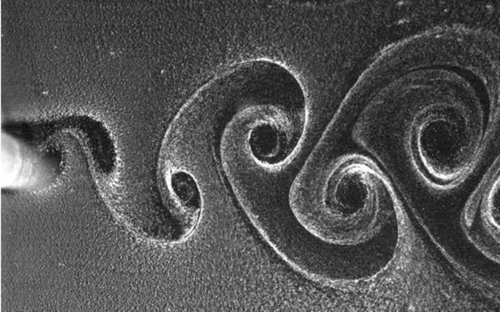
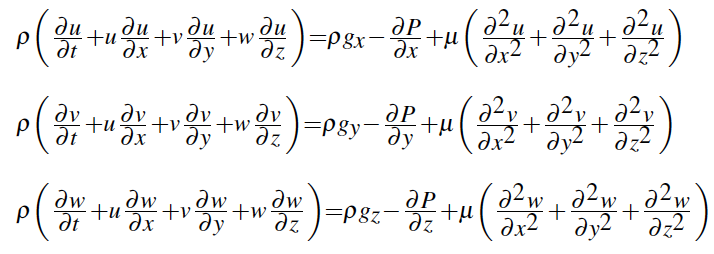
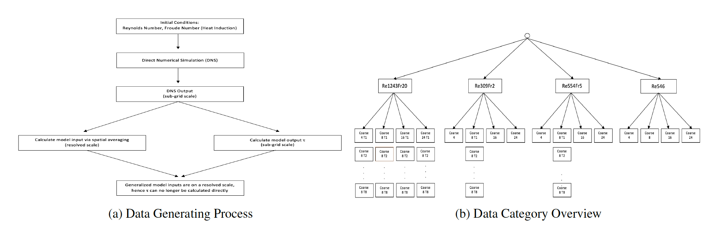

### Modeling small-scale turbulence in Large Eddy Simulations using Deep Learning
      
#### Problem Statement
Turbulence modeling remains one of the biggest challenges in engineering today, and has impacts ranging from aerodynamics to climate modeling. A plane cannot fly without jet propulsion and your car consumes the amount of fuel it does partly due to its aerodynamic properties. The image below shows fluid turbulence including several eddys (swirls).

Given the difficulty and high cost of observing turbulence in a natural environment, most turbulence models include some form of simulation. Among the most popular methods are Direct Numerical Simulations (DNS), and Large-Eddy Simulations, first proposed in 1963 by Joseph Smagorinsky [1] and first explored in 1970 by Deardorff [2].

The governing equations of these types of simulations are the Navier-Stokes equations, which represent Newton's second law applied to the x, y and z-direction of Newtonian fluids in motion:

Both simulation-based approaches mentioned above use these equations as follows:

* Direct Numerical Simulations (DNS) analytically solve the Navier-Stokes equation across all temporal and spatial scales. The main issue arises because current computing power is not sufficient to conduct a DNS on large scales.
* Large Eddy Simulations (LES) are more computationally efficient, by attempting to solve the Navier-Stokes equations on large scales only and subsequently  model the turbulence behavior on smaller scales. This is achieved via low-passed spacial filtering (i.e. a convolution kernel <bdi>G&Delta;(x)</bdi> of size <bdi>&Delta;</bdi> is applied), a method used to separate large (resolved scale) and small (sub-grid scale) eddys. Applying the kernel will remove sub-grid scale information and transforms the Navier-Stokes equations by adding a stress term <bdi>&tau;&Delta;</bdi> that needs to be modeled. 

The goal of our research was to identify new, efficient ways to model sub-grid scale turbulence via deep learning by using the pseudo-resolved scale outputs from an isolated DNS. Specifically, we want to apply Convolutional, Dense and Recurrent neural networks in order to model small-scale turbulence across space and time using non-linear regression analysis.

This project was part of ENGI 4800 - Data Science Capstone at Columbia.

#### Data Overview

Our datasets consist of 3-dimensional spatial cubes and  were generated using a high resolution DNS with differing initial conditions over a small spatial area. The sub-grid scale DNS output was then used to (1) calculate the model inputs via averaging over regions of differing sizes and (2) calculate the model outputs. With the DNS output being on a sub-grid scale, the spatial averaging was done in order to achieve a good proxy for the generalized input to the model, which will be on a resolved scale. Our goal was then to identify a function that maps input to output, since the true input will be on a resolved scale and will no longer allow us to calculate the output directly (see Figure a below).

A summary of our dataset categories can be found in Figure b above. These categories can be understood as follows:

<b>Layer 1: DNS Initial Conditions.</b> Each node is labeled Re-x-Fr-y, where x is the Reynolds Number and y is the Froude Number.
* The Reynolds Number is a dimensionless measure of turbulence. The higher the number the more turbulent the flow.
* The Froude Number is a dimensionless, relative measure of forces, defined as the ratio of inertial forces to external fields

Loosely speaking, the Froude number quantifies the addition of heat conduction from underneath as an initial condition. Such heat conduction may, for example, model stratified turbulence in the upper troposphere (i.e. the earth's lowest atmospheric layer). The last modeling setup (Re546) does not include any conductive heating and hence a Froude Number is not necessary. Note that the selected Reynolds and Froude Numbers are standard practice in turbulence modeling and are set by the researchers ([3],[4])

<b>Layer 2: Averaging Range.</b> For each Reynolds Number - Froude Number combination, we have different categories identified by coarse-z, where z is either 4, 8, 16 or 24. These numbers represent the grid-size over which the DNS outputs are averaged. As mentioned above, the DNS is averaged over a range of size (2z+1)x(2z+1)x(2z+1) in order to better mimic the generalized input to the model later on. Please note that for several data categories, we have data for 8 different time steps, T1 - T8.

<b>Layer 3 (not pictured): Datasets.</b> Within each Re-x-Fr-y coarse-z category, we have one sample of each of the following 3-D boxes for each time step:

| Variable       | Type       | Description                                     |
| -------------  | ---------- | ----------------------------------------------- |
| u              | Input      | velocity of a point (x,y,z) in the x-direction  |
| v              | Input      | velocity of a point (x,y,z) in the y-direction  |
| w              | Input      | velocity of a point (x,y,z) in the z-direction  |
| tke            | Input      | total kinetic enegery at a point (x,y,z)        |
| <bdi>&theta;</bdi> | Input  | temperature at a point (x,y,z)                  |
| p              | Input      | pressure at a point (x,y,z)                     |
| hxyz| Output     | heat flux                                       |
| <bdi>&tau;xyz&Delta;| Output | sheer stress due to low-pass filtering |

Due to the spatial averaging of the DNS output over regions of differing size, the four coarse-z data categories have input and output cubes of different sizes. They are as follows:

| Coarse       | Grid-size    | Input / Output Size  |
| ------------ | ------------ | -------------------- |
| 4            | (9x9x9)      | (296, 196, 153)      |
| 8            | (17x17x17)   | (146, 96, 72)        |
| 16           | (33x33x33)   | (71, 46, 36)         |
| 24           | (49x49x49)   | (46, 30, 23)         |

#### Modeling Overview

We have tried different types of deep learning models: DNN (base model), CNN (to capture spatial dependencies) and LSTM (to model time-dependencies). Initially, we trained independent models for each sheer stress and heat flux. Comparing the results for each model, we chose the DNN as our final model, due to its simplicity and accuracy. As for the training process, we have considered different input / output combinations, in order to determine which would be most generalizable. 

* Train on Re1243Fr20-coarse8 (base model)
* Train on Re1243Fr20-coarse4, Re1243Fr20-coarse8, Re1243Fr20-coarse16 and Re1243Fr20-coarse24 to isolate the effects of the averaging range
* Train on Re309Fr2-coarse8 and Re1243Fr20-coarse8 to isolate the effects of the initial conditions. Here Re309Fr2 shows the least amount of turbulence while Re1243Fr20 shows the most turbulence among all our datasets
* Train on Re309Fr2-coarse8 and Re1243Fr20-coarse8, both at time steps T1 and T2 to isolate the effects of temporal information

For a full overview of our modeling, please visit the [DNN folder](https://github.com/Codyz/dscaptstone/tree/master/Code/DNN).

#### How to navigate this repository:

      │
      ├── Archive
      |    |-- Contains outdated, experimental notebooks
      |
      ├── EDA
      │    |-- Contains two notebooks on eploratory data visualization of our input and output datasets
      |
      ├── Saved Models
      |    |-- Multi Output
      |    |    |-- Contains multi-output models, which predict all sheer stresses and heat flux simultaneously
      |    |-- Sinle Output
      |         |-- Base
      |         |    |-- Contains sinlge-output models for sheer stress and heat flux
      |         |-- Combined
      |         |    |-- Contains mutli-input single-output models with differing initial conditions
      |         |-- Combined_Time_Dependencies
      |              |-- Contains mutli-input single-output models with differing initial conditions and time steps
      |
      ├── Code
      |    |-- CNN
      |    |    |-- Contains experimental notebooks with Convolutional Neural Networks
      |    |-- LSTM
      |    |    |-- Contains experimental notebook with single-output LSTM for sheer stress
      |    |-- DNN
      |         |-- Final Models
      |         |    |-- Multi Output
      |         |         |-- Contains multi-output DNN models, which predict all sheer stresses and heat flux
      |         |         |-- Inputs: base input, differing conditions and differing conditions and time steps
      |         |    |-- Single Output
      |         |         |-- Contains single-output DNN models for heat flux and sheer stresses
      |         |         |-- Inputs: base input, differing conditions and differing conditions and time steps
      |         |-- Hyperparameter Checks
      |         |    |-- Includes checks for box size, input data, loss function and data scaling technique
      |         |-- Capstone_DNN_Correlation_by_layer.ipynb
      |         |    |-- Explores the true vs. pred. correlation evolution for each layer along the z-axis
      |         |-- Capstone_DNN_TauPredictions_by_layer.ipynb
      |         |    |-- Explores true vs. pred. distributions for several layers along the z-axis
      |         |-- Predictions
      |              |-- Multi Output
      |              |    |-- Contains predictions of multi-output models for heat flux and sheer stress
      |              |    |-- Inputs: base input, differing conditions and differing conditions and time steps
      |              |-- Single Output
      |              |    |-- Taus
      |              |         |-- Contains predictions of single-output models for sheer stresses
      |              |         |-- Inputs: base input, differing conditions and differing conditions and time steps
      |              |    |-- Heat
      |              |         |-- Contains predictions of single-output models for heat flux
      |              |         |-- Inputs: base input, differing conditions and differing conditions and time steps

--------------------------------
[1] J. Smagorinsky. General circulation experiments with the primitive equation. i. the basic experiment. Monthly Weather Review, 91, 1963. 
[2] J. B. Deardorff. A numerical study of three-dimensional turbulent channel flow at large reynolds numbers. J. Fluid Mech., 41, 05 1970. 
[3] Q. Li, P. Gentine, J. P. Mellado, and K. A. McColl. Implications of nonlocal transport and conditionally averaged statistics on moninobukhov similarity theory and townsends attached eddy hypothesis. Journal of the atmospheric sciences, 75, 10 2018. 
[4] M. Giometto, A. Lozano-Duran, P. Moin, and G. I. Park. Three-dimensional transient channel flow at moderate reynolds numbers: Analysis and wall modeling. 01 2017. 
